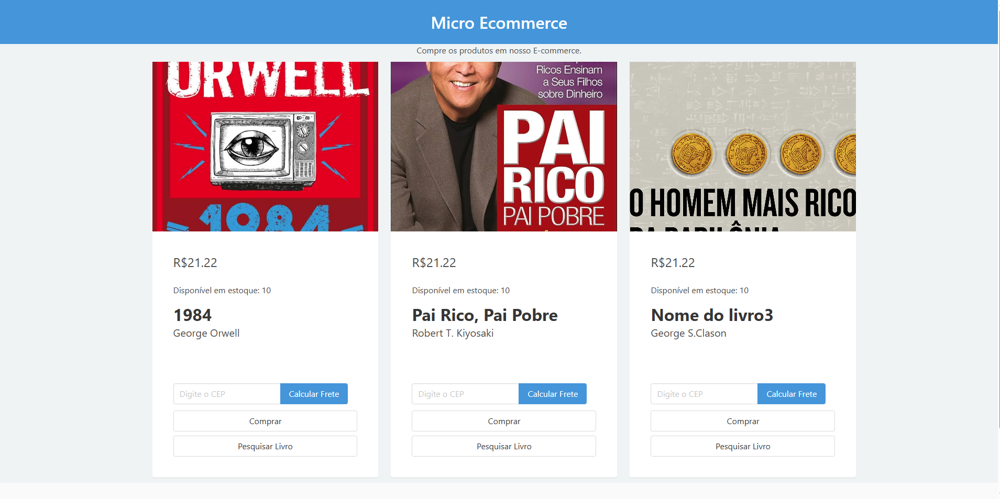

# 📚 Micro Livraria - Sistema com Microsserviços

Este projeto simula uma livraria digital com arquitetura baseada em **microsserviços**, utilizando Node.js, Express, gRPC e um front-end leve com HTML/CSS.



## 🚀 Como Executar Localmente

Para executar o sistema completo localmente, você precisa abrir **3 terminais diferentes** e iniciar cada microsserviço separadamente.

### Passo 1: Clone o Repositório e Instale Dependências

```bash
git clone https://github.com/joaoespeleta/microecommerce_livraria
cd microecommerce_livraria/services
npm install
```

### Passo 2: Inicie os microsserviços (em terminais separados)

No **primeiro terminal**, inicie o microsserviço de inventário:

```bash
npm run start:inventory
```

No **segundo terminal**, inicie o microsserviço de frete (shipping):

```bash
npm run start:shipping
```

No **terceiro terminal**, inicie o microsserviço controller:

```bash
npm run start:controller
```

---

### Passo 3: Teste a API do Backend

Você pode testar o endpoint para listar todos os produtos com `curl`:

```bash
curl -i -X GET http://localhost:3000/products
```

Ou acessando diretamente no navegador:

```
http://localhost:3000/products
```

---

### Passo 4: Acesse o Front-end

Abra o endereço abaixo no navegador para usar o front-end da livraria:

```
http://localhost:5000
```

---

## 🛠 Funcionalidades

- Listagem de livros
- Cálculo de frete por CEP
- Compra de livros
- 🔍 Pesquisa de livros por ID (nova funcionalidade implementada)

### Endpoint para pesquisar livro por ID

```
GET /product/:id
```

Exemplo:

```
http://localhost:3000/product/1
```

---

## 📁 Estrutura de Diretórios

```
micro-livraria/
├── assets/
│   └── index.png
├── proto/
│   └── inventory.proto
|   └── shipping.proto
├── services/
│   ├── controller/
│   │   └── index.js
|   |   └── inventory.js
|   |   └── shipping.js
|   ├── frontend/
|   │   └── index.css
│   |   └── index.html
│   |   └── index.js
│   ├── inventory/
│   │   └── index.js
│   │   └── products.json
│   └── shipping/
│       └── index.js
├── package.json
└── README.md
```

---

## 📌 Observações

- Após modificar **somente arquivos CSS ou front-end**, não é necessário reiniciar os microsserviços.
- A nova operação `SearchProductByID` está implementada no microsserviço Inventory e integrada no Controller para chamada via rota REST.
- Um botão **Pesquisar Livro** foi adicionado no front-end para testar esta funcionalidade.

---

## ✅ Status

✔️ Projeto funcional com todos os requisitos da atividade atendidos.

---

## 🧑‍💻 Autor

- João Espeleta
